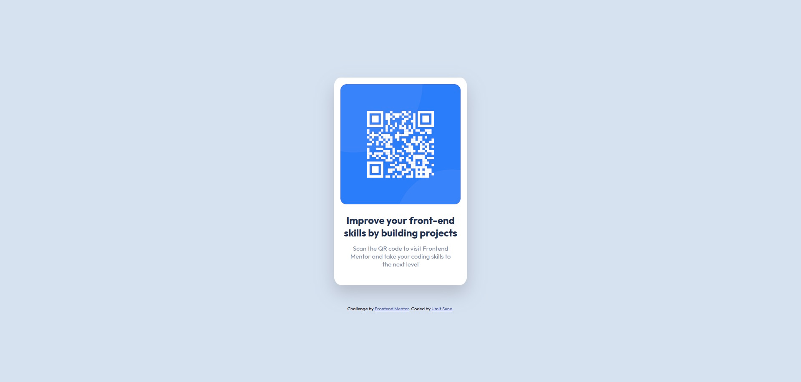

# Frontend Mentor - QR code component solution

This is a solution to the [QR code component challenge on Frontend Mentor](https://www.frontendmentor.io/challenges/qr-code-component-iux_sIO_H). Frontend Mentor challenges help you improve your coding skills by building realistic projects. 

## Table of contents

- [Screenshot](#screenshot)
- [Links](#links)
- [Built with](#built-with)
- [Author](#author)

### Screenshot

This is a screenshot of my solution for this challenge. 

### Links

- Click for:[Live Solution URL](https://umitsuna.github.io/)

### Built with

- Semantic HTML5 markup
- CSS custom properties
- Flexbox

## Author

- Website - [Umit Suna](https://umitsuna.com)
- Frontend Mentor - [@umitsuna](https://www.frontendmentor.io/profile/umitsuna)

